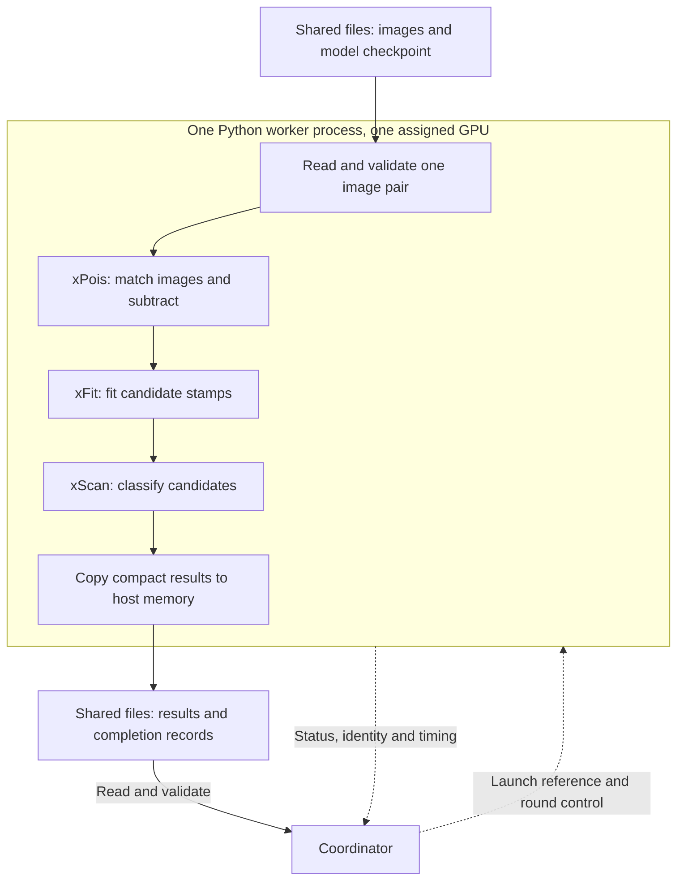

# Distributed execution architecture

cuPhoton uses Dragon or MPI to run independent work on several GPUs. Each
GPU worker is a Python process bound to one GPU. The worker loads its inputs,
runs the numerical code and writes its results. A coordinator assigns work
and checks completion. Dragon defaults to one worker per GPU. Its shared
executor can place several independent workers on the same GPU.

The choice of Dragon or MPI controls process placement and coordination. The component
and numerical backend control the calculation. For example, the combined
imaging pipeline uses CuPy and PyTorch inside each worker with either runtime.

Read [How cuPhoton uses Dragon](dragon.md) or [How cuPhoton uses MPI](mpi.md)
for the process and message details. The [distributed launch guide](distributed-execution.md)
contains environment setup, manifests and Slurm/SSH commands.

## Units of work

The optical workflows divide a batch into independent items:

| Workflow | One item |
| --- | --- |
| xPois batch fitting | One aligned reference/target image pair |
| xFit batch fitting | A range of candidate stamps |
| xScan inference | A range of samples that preserves the planned minibatches |
| Combined xPois, xFit and xScan pipeline | One image pair with its candidate coordinates |

An imaging worker completes all stages for an assigned pair on its assigned GPU.
The executors do not split that pair across GPUs or exchange intermediate
images between workers. The distributed xRay detector workflow has a separate
[tile and artifact contract](xray/DISTRIBUTED-DETECTOR-ARTIFACTS.md).

A `WorkItem` contains an ID, a JSON description and a weight for assignment.
The description refers to files, array properties or sample ranges. It does
not contain a live GPU array.

cuPhoton sorts items by descending weight and assigns each to the worker
with the smallest total weight. Each worker receives a fixed list, called
a *shard*. Weights usually estimate input bytes. xScan uses sample counts.
They do not predict execution time exactly. Workers process their shards
sequentially, with no work stealing. A round waits for its slowest worker.

## Where the data goes

This diagram shows the combined imaging pipeline inside one worker. The
other workers run the same stages on their own assigned pairs.

Dragon passes a reference to a shared launch file. MPI ranks plan items
locally or receive them in a broadcast.

Workers read inputs directly from the shared filesystem. NPY inputs pass
through host memory before a GPU upload. FITS inputs use the configured
reader, which can return host or device arrays. See the
[FITS reader guide](components/xdr.md#read-fits-images-in-a-workflow) for that choice.

The combined pipeline keeps intermediate image and stamp arrays on the GPU.
CuPy and PyTorch share compatible device buffers through DLPack, an array
exchange interface. cuPhoton retains the buffer owners until the GPU work
finishes. These transfers occur within one process. Dragon and MPI carry
descriptions and completion metadata. They do not transport these GPU buffers.

Workers write scientific outputs and completion records to shared storage.
The coordinator reads those records and checks the expected item IDs,
input identities and output files. The filesystem therefore carries both
bulk input/output and part of the completion protocol.

## Process ownership

| Responsibility | Dragon | MPI |
| --- | --- | --- |
| Start the application | Dragon launcher starts a coordinator within its runtime | MPI launcher starts all ranks |
| Start GPU workers | Coordinator creates a native Dragon `ProcessGroup` | Each rank is a GPU worker |
| Coordinate the run | Separate coordinator process | Rank 0, which also computes its shard |
| Select each GPU | Dragon host and GPU placement policy | Launcher binding and per-node rank mapping |
| Exchange status | Dragon native queues | MPI collectives; the xPois file mode uses shared files |

Each worker must see one assigned GPU before a numerical library initializes
CUDA. Inside that process, the assigned GPU is device 0. cuPhoton records
the host, process ID and physical GPU identity. A CUDA ordinal alone does
not identify a physical GPU.

MPI and the default Dragon configuration require distinct GPUs. With Dragon
sharing enabled, workers assigned to the same GPU must report the same
physical identity. Workers assigned to different GPUs must report different
identities. See [Dragon GPU sharing and MPS](dragon.md#share-a-gpu-between-workers)
for placement, connection checks and service ownership.

Every node needs compatible software and access to the input, model and
output paths at the same absolute locations. The launch guide describes
these requirements and how to preserve scheduler GPU restrictions.

## What workers retain

In repeated runs, each GPU worker stays alive through all requested warmup
and measured rounds. A round repeats the same shards. Warmup rounds run real work and retain their outputs.

| Worker | State retained between items or rounds |
| --- | --- |
| xPois repeated batch | Process and CUDA context; inputs are read again each round |
| xFit | Validated input, solver settings, model and CUDA context |
| xScan | Dataset, metadata rows, model and data loader |
| Combined pipeline | Model, CUDA streams and device context; each pair is read again |

Each additional Dragon worker retains its own component state, including its
model where applicable. More workers can increase host and device memory use.
The pipeline also offers local process and thread executors; see the
[GPU sharing guide](components/xscan.md#share-a-gpu-between-image-pairs).

Keeping a process alive does not keep every input image on the GPU. Output
writes, input checks and any required transfers still occur. Ordinary
single-pass xPois uses its own executor path. The Dragon and MPI pages
describe it.

## Completion and failure

The shared executors collect a completion record from each worker after a
round. They then validate the item records and run any component-specific
merge step. A record of success must agree with the files on disk.

For a successful run, workers close their component resources before the
coordinator publishes the final `summary.json`. Failed work, missing records
or GPU identities that disagree with the requested placement make the run
fail. Failed shutdown also makes the run fail. A successful round alone does not
establish a successful complete run.

These executors do not reschedule a failed item onto another worker.
Completed files remain available for diagnosis. Validation confirms one terminal record per expected item. It does not
retry or recover work.

## Timing boundaries

The reported `batch_wall_sec` covers round dispatch through worker completion
collection. Worker completion includes its item processing and record writes.
Coordinator validation and component merging follow this interval. The shared
executor reports component merging as `finalization_sec`.

Measure launcher-to-exit wall time separately to include runtime startup and
process teardown. Keep warmup, readiness and shutdown costs visible when
comparing Dragon and MPI. Subtracting the longest worker time from batch time
does not isolate network latency. See
[transport measurements and timing](dragon-performance.md#evidence-and-timing-boundaries)
for the existing experiments and their limits.

## Source map

| Source | Responsibility |
| --- | --- |
| [`core/bulk.py`](../src/cuphoton/core/bulk.py) | Work items, shard assignment and completion-record checks |
| [`core/execution.py`](../src/cuphoton/core/execution.py) | Component worker contract, item execution and round validation |
| [`core/executors.py`](../src/cuphoton/core/executors.py) | Select Dragon or MPI |
| [`xscan/pipeline_executor.py`](../src/cuphoton/xscan/pipeline_executor.py) | Adapt the imaging pipeline to the shared executors |
| [`xscan/device_pipeline.py`](../src/cuphoton/xscan/device_pipeline.py) | Run the imaging stages and manage device-buffer lifetimes |
