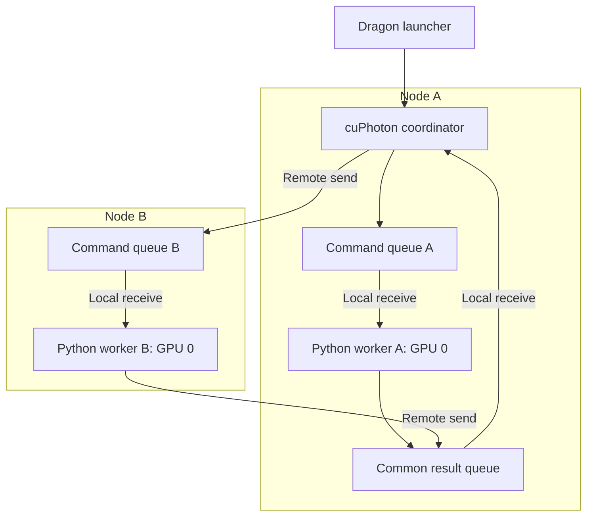
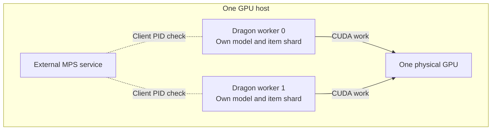
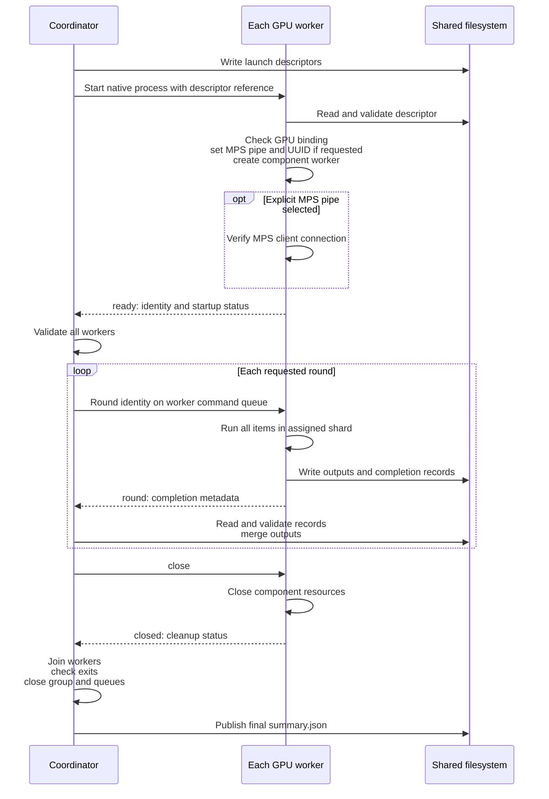

# How cuPhoton uses Dragon

cuPhoton uses Dragon to place Python workers on GPU nodes and collect their
completion messages. Each worker is bound to one GPU and runs complete work
items. By default, cuPhoton places one worker on each GPU. Optional sharing
lets several independent workers use the same GPU. The coordinator assigns
work, checks results and stops the workers.

Dragon carries control messages and result metadata. In the combined imaging
pipeline, each worker runs xPois, xFit and xScan on its assigned image pairs.
Intermediate image arrays stay on that worker's GPU.

The [distributed architecture](distributed.md) describes the common work and
data model. The [launch guide](distributed-execution.md) provides runnable
examples. [Transport and performance](dragon-performance.md) covers TCP,
HSTA, queue placement experiments and timing limits.

## Processes and queues

The Dragon launcher starts the cuPhoton coordinator within the Dragon
runtime. The coordinator uses Dragon's native API to discover nodes, select
GPUs and create workers. It creates one `ProcessGroup` containing one
`ProcessTemplate` per worker.

The shared executor uses one command queue per worker and one common result
queue. The coordinator creates each command queue with a placement policy
for that worker's host. The result queue resides with the coordinator.

This example shows the default arrangement, with one worker per GPU. The coordinator is a separate process
and needs no assigned GPU. Dragon's own runtime services are omitted from
the diagram. Each node can host several workers. Each worker has its own
command queue and one assigned GPU.

The queues contain Python metadata. They do not contain image pixels, model
weights or CUDA buffers. Workers read input and model files directly from
shared storage, then write their outputs there. A result message includes
status, item identities, placement and timing. Its size can grow with the
number of assigned items.

## Select hosts and bind GPUs

cuPhoton reads the node list through `System` and each node's GPU IDs through
`Node.gpus`. It uses the reported IDs, including nonconsecutive IDs. Selection
rotates across hosts before taking a second GPU from each host. It uses
distinct GPUs before assigning another worker to a GPU.

The shared executor limits workers to the item count and the available GPU
count multiplied by `--workers-per-gpu`. The default is one worker per GPU.
`--max-workers` caps the total process count. cuPhoton assigns each worker
a fixed shard of items. A Dragon `Policy` specifies the hostname and one GPU affinity
for that process.

Before creating the component worker, cuPhoton checks the actual hostname and
`CUDA_VISIBLE_DEVICES`. The worker must see exactly the requested GPU.
The check rejects prior imports of CuPy, Numba CUDA or cuTile, or an
initialized Torch CUDA runtime. The component then initializes its numerical libraries and uses local device 0.
The worker reports its physical GPU identity. Workers assigned to the same
GPU must agree on that identity. Workers assigned to different GPUs must
report different identities.

This ordering matters because a CUDA library can retain the device selection
from its first initialization. Changing the visibility environment afterward
does not move an existing CUDA context.

## Share a GPU between workers

`--workers-per-gpu N` permits up to N worker processes on each GPU. For
example, four GPUs with two workers per GPU provide eight worker slots.
Item count and `--max-workers` can reduce the actual worker count.

Each worker processes complete items and retains its own component state. The combined pipeline therefore
loads a separate model for each worker. More workers can increase memory
use and contention. Measure batch time and memory use for the intended inputs
before choosing a worker count.

Each process still has a command queue and sends results to the common
result queue. More workers mean more queues, launch descriptors and completion
messages. The shared lifecycle below applies to every worker.

### Connect workers to MPS

The worker count and MPS connection are separate choices. Multiple processes
can share a GPU under ordinary CUDA scheduling. An MPS service allows CUDA
work from different processes to overlap on the device.

`--mps-pipe-directory PATH` requires every worker to connect to an existing
MPS v2 service. The launcher or administrator starts that service and owns
its resource limits and shutdown. cuPhoton does not start or stop MPS or
change GPU compute mode.

The diagram shows two workers sharing a GPU with MPS. Each retains the
Dragon queues shown in the earlier diagram. MPS connection checks are
separate from Dragon's round commands and results.

Before creating the component worker, cuPhoton checks Dragon's initial GPU
binding. It then sets `CUDA_MPS_PIPE_DIRECTORY`, resolves the device's UUID
with `nvidia-smi`, and replaces `CUDA_VISIBLE_DEVICES` with that UUID. All
three steps happen before CUDA initialization. UUID binding avoids changes
in device numbering under MPS. Each process still uses local device 0.

After CUDA initialization, cuPhoton queries the MPS control daemon for its
servers and their clients. The queries have a shared 10-second deadline.
The worker PID must appear in a returned client list.

The worker reports readiness only after that check succeeds. Its startup record includes the GPU UUID and the MPS
client and server PIDs. A missing service or failed connection check fails
startup.

On multiple hosts, use the same absolute, node-local pipe path on every
worker host. The MPS service and its clients must use the same PID namespace
for the connection check. Without the explicit pipe option, cuPhoton leaves
inherited MPS settings in effect and does not verify an MPS connection.
Omitting the option does not prove that MPS is disabled.

Sharing and MPS options apply to `xfit fit-dipoles`, `xscan infer-real-bogus`
and `xscan run-pipeline` with `--executor dragon`. Standalone xPois and the
Python `run_dragon_device_pipeline()` API retain one worker per GPU. MPI
also retains one rank per physical GPU and rejects these sharing options.
The [GPU sharing guide](components/xscan.md#share-a-gpu-between-image-pairs)
contains commands and describes the separate local process and thread modes.

## Load launch descriptors from shared files

Here, a *launch descriptor* is a JSON file with a worker's assigned items,
options and placement. It is not an operating-system file descriptor.

The coordinator writes one descriptor per worker under the run's `launch/`
directory. It passes the path, expected SHA-256, small validation context and
queue handles as process arguments. The worker checks the descriptor before
it imports and creates the component worker.

This keeps a large manifest out of each process-launch request.
cuPhoton rejects serialized launch arguments larger than 96 KiB. That guard
applies to the arguments, not to all queue messages or the descriptor file.
The shared filesystem must remain accessible during worker startup.

## Shared worker lifecycle

xFit, xScan inference and the `xscan run-pipeline` command use the shared
executor in `cuphoton.core.dragon`. They use this protocol for one round as
well as repeated rounds:

The diagram shows a successful run. The coordinator waits for every `ready`
message before it releases the first round. Each round command identifies
the run and round; it does not send a new shard. The same component object
processes every requested round.

Each command queue has capacity one. The result queue has capacity
for twice the worker count. After the final round, workers wait for `close`
before they send `closed`. This lets the coordinator finish collecting and
checking round results before normal shutdown starts.

## Why queue placement matters

An idle worker blocks in a receive on its own command queue. Placing
that queue on the worker's host keeps the wait local. The coordinator sends
a small message to that host when a round can start.

With Dragon 0.14.2's Python TCP transport, many idle receives on remote queues
can consume transport executor threads. If every command queue resides on
the coordinator's node, those waits can delay other control messages.
cuPhoton's repeated-round and shared paths place command queues with their
consumers to avoid that layout.

The Dragon launcher selects application and overlay transports. cuPhoton does
not select a transport or change its thread limits. Native HSTA uses a
different progress implementation. The
[transport guide](dragon-performance.md#place-command-queues-with-their-consumers)
explains the observed behavior and the measurements behind this choice.

## xPois uses a separate executor

The xPois batch command predates the shared executor and retains a different
protocol:

| Entry point | Worker protocol |
| --- | --- |
| `xpois fit-batch`, ordinary run | Process one assigned shard, send one result and exit. No command queue or readiness handshake. |
| `xpois fit-batch`, repeated rounds | Report readiness, wait for round commands and repeat the same shard. Exit after the final round, without the shared `close`/`closed` handshake. |
| `xscan run-pipeline` command | Use the shared lifecycle shown above. |
| Python `run_dragon_device_pipeline()` | Use the single-pass xPois coordinator. Retain one device context across the items in a shard. |

Ordinary xPois gives its result queue one slot per worker. The coordinator
joins the workers before draining those results. Repeated xPois adds command
queues on the workers' hosts. Both paths use native Dragon processes and
fixed assignments.

The word *persistent* depends on the entry point. In a single-pass path,
a context persists across the items of one shard. In repeated rounds, it
persists across complete rounds.

## Local xScan loader processes

Distributed xScan inference defaults to `--num-workers 0`, so the GPU worker
also loads its batches. A positive value requests local data-loader child
processes for each GPU worker. They prepare batches; the parent runs the
model on its GPU.

The shared Dragon executor sets `DRAGON_PATCH_MP=""` in each native worker's
environment. Python's multiprocessing module then stays unpatched in that
worker. Spawned loader children receive ordinary multiprocessing queues.
The xScan CUDA loader defaults to the `spawn` start method.

The outer GPU workers still use native Dragon processes and queues. Loader
children start before the GPU worker reports `ready`, persist across tasks
and rounds, and stop when the component worker closes.

## Failures and shutdown

cuPhoton creates the process group with restart disabled. cuPhoton does not move failed
items to healthy workers. An item exception produces a failed record, and
the shared worker continues through its remaining items. A failed round
prevents the next round from starting.

The coordinator checks received messages against the run, worker and round
identities. It also checks files on disk, physical GPU assignments and process
exit status. Missing results, unexpected exits and failed cleanup make the
run fail.

On failure, the coordinator attempts to stop the group and close its queues.
A forced process termination can prevent Python cleanup or a final `closed`
message. Retained records describe completed work and observed errors. They do not
show that every worker completed cleanup.

For a successful shared run, the coordinator publishes terminal success only
after worker shutdown and lifecycle checks. Inspect the root `summary.json`
as well as the launcher exit status. Use the timeout and cleanup guidance in
[the launch guide](distributed-execution.md#inspect-the-run).

## Source map

| Source | Responsibility |
| --- | --- |
| [`core/dragon.py`](../src/cuphoton/core/dragon.py) | Discovery, placement, queues, shared worker protocol and shutdown |
| [`core/execution.py`](../src/cuphoton/core/execution.py) | Component construction contract, item records and validation |
| [`core/mps.py`](../src/cuphoton/core/mps.py) | Verify client connections to an externally managed MPS v2 service |
| [`xpois/dragon.py`](../src/cuphoton/xpois/dragon.py) | xPois single-pass and repeated-round protocols |
| [`xscan/dragon_pipeline.py`](../src/cuphoton/xscan/dragon_pipeline.py) | Python device-pipeline API using the single-pass coordinator |
| [`xscan/executor.py`](../src/cuphoton/xscan/executor.py) | xScan model and local loader lifetime |

The upstream [Dragon native API reference](https://dragonhpc.github.io/dragon/doc/_build/html/ref/native/index.html)
describes the process, queue and placement primitives used here.
