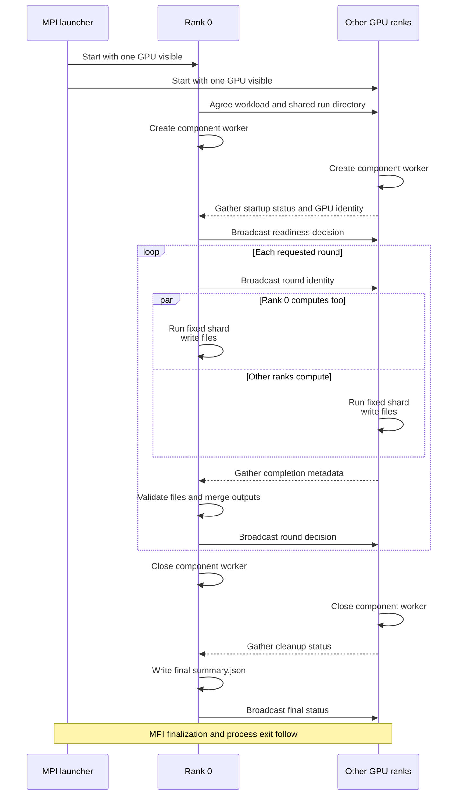

# How cuPhoton uses MPI

cuPhoton uses MPI to run the same independent GPU work described in the
[distributed architecture](distributed.md). The MPI launcher starts all
processes. Each process has a rank and uses one assigned GPU. Rank 0 also coordinates
the run while computing its own assigned shard.

The [launch guide](distributed-execution.md) provides Open MPI commands for
Slurm and SSH. [How cuPhoton uses Dragon](dragon.md) describes the alternative
process and queue model. MPI retains one rank per physical GPU and rejects
`--workers-per-gpu` and `--mps-pipe-directory`.

## Bind each rank before CUDA starts

For Open MPI, `cuphoton-openmpi-rank-exec` runs before Python starts. It selects
one entry from the allocation's `CUDA_VISIBLE_DEVICES` list using the rank's
position on its node. It preserves the original list in
`CUPHOTON_ALLOCATED_CUDA_VISIBLE_DEVICES`, then executes the application.

The launcher wrapper or scheduler must restrict each rank to one visible GPU
before Python starts. This protects against MPI installations that initialize
CUDA during import. The shared executor checks GPU visibility, then imports
mpi4py even if that check failed so all ranks can agree on startup errors.
The numerical code uses device 0 within each rank's restricted visibility.

The wrapper expects the full per-node GPU list in local-rank order. It
rejects a local rank outside that list. When the scheduler already gives each task one visible GPU, launch without
the wrapper. Other MPI implementations
need their own launcher or scheduler binding.

After MPI starts, cuPhoton compares the launcher's rank variables with the
MPI communicator and collects physical GPU identities. It rejects duplicate GPU assignments. The shared executor also
rejects more ranks than work items, so each rank has work.

## Shared executor lifecycle

xFit, xScan inference and `xscan run-pipeline` use `cuphoton.core.mpi`.
Rank 0 creates the run directory and coordinates validation. All ranks create
one component worker and retain it through the requested rounds.

These exchanges use collectives. Every rank, including rank 0, participates
in each `gather` and `bcast` call. They are not independent command
queues. Rank 0 executes its shard before it completes result collection.

The shared executors exchange Python metadata through MPI. Workers read
inputs and write scientific outputs through the shared filesystem. A
readiness token checks that all ranks see the same run directory. The
coordinator compares completion messages with the records on disk before
it accepts a round.

No imaging stage requires an MPI reduction of pixels or GPU arrays. Each
worker completes its own items. Scientific finalization joins component
outputs after the workers have written them.

## What happens after a failure

Ordinary item exceptions become failed records. Each rank continues through
its remaining assigned items, then participates in completion collection.
A failed round stops subsequent rounds. Errors during component cleanup
also make the final run fail.

A dead or hung rank can prevent a collective from completing. The
`--rank-setup-timeout-sec` value bounds shared-filesystem waits only. It does
not bound MPI collectives or stop rank processes.
The MPI launcher and scheduler must enforce process-failure and job-timeout
policies. cuPhoton does not replace failed ranks or redistribute their work.

A successful final summary covers the application checks and component
cleanup. MPI finalization and process exit happen afterward. Check the
launcher result as well as the summary when recording a successful run.

## xPois collective and file modes

The xPois `fit-batch` command has its own MPI executor. It assigns whole
image pairs to ranks, with rank 0 participating in the numerical work.
Its collective mode supports persistent warmup and measured rounds.

The xPois file mode uses the launcher's rank environment without importing
mpi4py. Ranks publish preflight and completion information through shared
files. Rank 0 validates and aggregates those files. This mode requires
explicit run and attempt identities and does not support repeated rounds.

File-mode peers return after publishing their completion records. Rank 0's
aggregation timeout does not terminate peers that are still running. See
[the xPois MPI guide](components/xpois.md#launch-with-mpi)
for commands and recovery behavior.

## Source map

| Source | Responsibility |
| --- | --- |
| [`core/mpi.py`](../src/cuphoton/core/mpi.py) | Shared collective lifecycle, readiness, round decisions and cleanup |
| [`core/_mpi_runtime.py`](../src/cuphoton/core/_mpi_runtime.py) | Rank discovery and GPU binding checks |
| [`cuphoton-openmpi-rank-exec`](../scripts/cuphoton-openmpi-rank-exec) | Set GPU visibility before Python and MPI startup |
| [`xpois/mpi.py`](../src/cuphoton/xpois/mpi.py) | xPois collective and file modes |

The [common timing description](distributed.md#timing-boundaries) separates
batch execution from validation, startup and process teardown.
